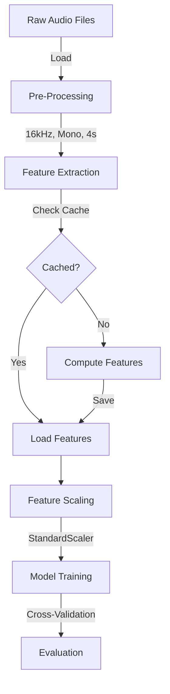

# Project Architecture Overview

This document details the technical architecture of the UrbanSound Classification project.

## 🔄 Data Flow Pipeline

## 🛠️ Key Components

### 1. Pre-Processing (`src/pre_processing.py`)
Standardizes all audio inputs to ensure consistent model input.
- **Resampling**: Converts all audio to **16,000 Hz** (`config.TARGET_SR`).
- **Normalization**: Amplitudes are normalized to the range [-1, 1].
- **Duration Standardization**: 
  - Clips longer audio to **4 seconds**.
  - Pads shorter audio with zeros (silence) to reach 4 seconds.

### 2. Feature Extraction (`src/feature_extraction.py`)
Transforms raw audio waves into numerical features. Two feature sets are defined:

#### **A. Baseline Feature Set**
Simple combination of distinct feature types:
- **MFCCs**: Mel-frequency cepstral coefficients (timbre/envelope).
- **Spectral Features**: Centroid, rolloff, zero-crossing rate, contrast.
- *Total Feature Vector size*: Depends on `N_MFCC` and stats (mean/std).

#### **B. XGBoost Feature Set (`_features_xgb`)**
A rich feature set optimized for tree-based models:
- **MFCCs**: Standard MFCCs.
- **Deltas & Delta-Deltas**: First and second-order derivatives of MFCCs (captures speech dynamics).
- **Mel Spectrogram**: Log-scaled power Mel spectrogram statistics (mean/std).
- **Spectral Features**: Same as baseline but potentially extended.

### 3. Model Training (`src/train.py`, `src/models.py`)
- **Model Factory**: Supports multiple architectures (SVM, Random Forest, XGBoost, etc.).
- **Scaling**: Uses `StandardScaler` to normalize feature distributions (crucial for SVM/Neural Nets).
- **Cross-Validation**: Performs 10-fold cross-validation during training to verify stability.
- **Persistence**: Saves trained models (`.pkl`) and their corresponding scalers.

### 4. Evaluation (`src/evaluate.py`)
Generates comprehensive performance metrics:
- **Metrics**: Accuracy, Precision, Recall, F1-Score (Weighted).
- **Visualizations**: 
  - Confusion Matrices (heatmap of predicted vs true labels).
  - Classification Reports (per-class performance).
  - Model Comparison Charts.

## 📂 Data Structure
The project relies on specific folder structures defined in `config.py`:
- `data/raw/urbansound8k`: Source audio files (folds 1-10).
- `data/processed`: Cached features (speeds up repeated training).
- `results/models`: Saved `.pkl` model files.
- `results/figures`: Generated plots and charts.
